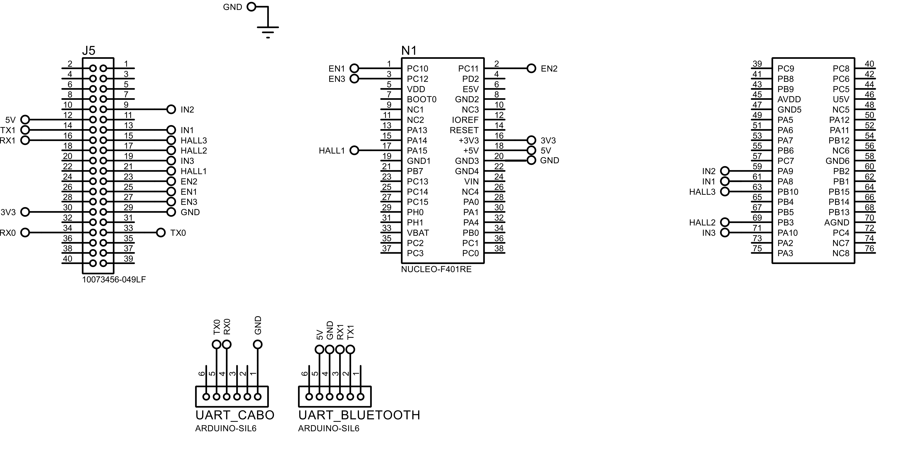

# PCB File

The folder contains the **Proteus** project for the final PCB used in this project, provided as a compressed `.zip` file. This PCB is designed to interface with the following hardware components:

- **STMicroelectronics** X-NUCLEO-IHM07M1 brushless motor shield;
- UART module;
- Bluetooth module (via UART); and
- FPGA.

The schematic and pinout details are shown in the image below:

This project was developed using Proteus version 8.17. To open and modify the file, ensure you have the same version or a newer one installed.
